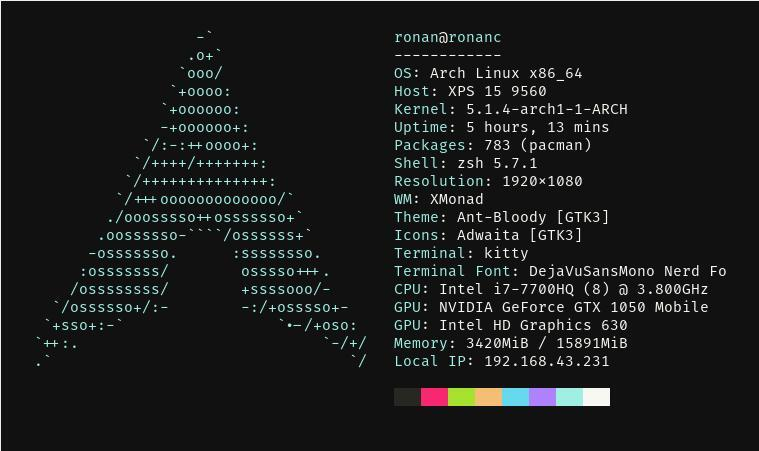

# My Dotfiles

If you're just passing through and see something you think could be better, then let me know!\
_README might be out of date._

## Text Editor / IDE - NeoVim

Recommend using [NeoVim](https://neovim.io/) over Vim for better plugin support and faster updates.
For dependencies run `:checkhealth`.

Language Support

 - Haskell\*
 - Python
 - JavaScript/TypeScript
 - C/C++\*
 - Java
 - Docker
 - HTML/CSS
 - YAML/JSON
 - LaTex/Markdown

\*_Requires manual install. See language servers below._

Plugins

Plugins are loaded after Vim starts so startup time should be ~50ms.

**General**

- [rhysd/reply.vim](https://github.com/rhysd/reply.vim)
    - REPL support.
- [Konfekt/FastFold](https://github.com/Konfekt/FastFold)
    - Faster folding.
- [Ron89/thesaurus_query.vim](https://github.com/Ron89/thesaurus_query.vim)
    - Thesaurus in Vim.
- [alvan/vim-closetag](https://github.com/alvan/vim-closetag)
    - Better HTML tag creation.
- [tpope/vim-eunuch](https://github.com/tpope/vim-eunuch)
    - Common shell commands for files in Vim.
- [sheerun/vim-polyglot](https://github.com/sheerun/vim-polyglot)
    - Huge language support plugin collection.
- [honza/vim-snippets](https://github.com/honza/vim-snippets)
    - Collection of common snippets (Used with coc.nvim).
- [iamcco/markdown-preview.nvim](https://github.com/iamcco/markdown-preview.nvim)
    - Live markdown previewing.
- [jamessan/vim-gnupg](https://github.com/jamessan/vim-gnupg)
    - Edit GPG encrypted files.
- [janko/vim-test](https://github.com/janko/vim-test)
    - Run tests for multiple languages.
- [junegunn/goyo.vim](https://github.com/junegunn/goyo.vim)
    - Zen mode for Vim.
- [junegunn/vim-easy-align](https://github.com/junegunn/vim-easy-align)
    - Align text easily.
- [lervag/vimtex](https://github.com/lervag/vimtex)
    - Latex compiling and viewing.
- [liuchengxu/vista.vim](https://github.com/liuchengxu/vista.vim)
    - Tag manager for code.
- [machakann/vim-sandwich](https://github.com/machakann/vim-sandwich)
    - Manipulate text between pairs of characters.
- [simnalamburt/vim-mundo'](https://github.com/simnalamburt/vim-mundo')
    - Manage the undo tree for files.
- [neoclide/coc.nvim](https://github.com/neoclide/coc.nvim)
    - Support for language servers, snippets and other extensions.
- [numirias/semshi](https://github.com/numirias/semshi)
    - Python semantic highlighting (Better than syntax highlighting!).
- [rhysd/vim-grammarous](https://github.com/rhysd/vim-grammarous)
    - Grammar checking in Vim.
- [scrooloose/nerdcommenter](https://github.com/scrooloose/nerdcommenter)
    - Manage code blocks for multiple languages.
- [Shougo/defx.nvim](https://github.com/Shougo/defx.nvim)
    - Directory tree plugin.
    - Also uses these addons:
        - [kristijanhusak/defx-icons](https://github.com/kristijanhusak/defx-icons)
        - [kristijanhusak/defx-git](https://github.com/kristijanhusak/defx-git)
- [mhinz/vim-signify](https://github.com/mhinz/vim-signify)
    - VC markers in files.
- [tpope/vim-fugitive](https://github.com/tpope/vim-fugitive)
    - Best Git plugin ever.
- [vim-airline/vim-airline](https://github.com/vim-airline/vim-airline)
    - Extensible and pretty statusline.
    - Also uses: [vim-airline/vim-airline-themes](https://github.com/vim-airline/vim-airline-themes)
- [w0rp/ale](https://github.com/w0rp/ale)
    - Linting and fixing tool support for nearly everything.
- [whiteinge/diffconflicts](https://github.com/whiteinge/diffconflicts)
    - Nice Git diff fixing.
- [kkoomen/vim-doge](https://github.com/kkoomen/vim-doge)
    - Multi language docstring support.
- [machakann/vim-swap](https://github.com/machakann/vim-swap)
    - Manipulate lists of items (List contents, function arguments etc...)
- [rhysd/clever-f.vim](https://github.com/rhysd/clever-f.vim)
    - Better `f` and `t` keys.
- [justinmk/vim-sneak](https://github.com/justinmk/vim-sneak)
    - Quick navigation commands.
- [junegunn/vim-peekaboo](https://github.com/junegunn/vim-peekaboo)
    - Preview register contents.
- [tpope/vim-unimpaired](https://github.com/tpope/vim-unimpaired)
    - Common useful commands bound to keys.

Exterior Tools

- Fast code searching: [The Silver Searcher](https://github.com/ggreer/the_silver_searcher)
- Language Servers: 
  - [Clangd](https://clang.llvm.org/extra/clangd/)
  - [Haskell IDE Engine](https://github.com/haskell/haskell-ide-engine)

Key Mappings

#### Langage Server Commands

My leader key is set to default "\\" key.
These are only some of my mappings and are likely out of date.
Check [here](./.vimdir/autoload/plugins.vim) for all mappings.

*Prefix*: `<Leader>l` (Lower case L)

| Suffix           | Command                               |
| :----:           | :-----------------------------------  |
| `d`              | Definition (In vertical split)        |
| `D`              | Definition (In current buffer)        |
| `r`              | Rename                                |
| `f`              | Format Document                       |
| `t`              | Type Definition                       |
| `x`              | References                            |
| `a`              | Code Actions Menu                     |
| `k`              | Hover (Loo**k**up)                    |
| `h`              | Hightlight                            |
| `g`              | Diagnostic Info at Cursor             |
| `i`              | Diagnostic List for Document          |

#### Git Commands

*Prefix*: `<Leader>g`

| Suffix           | Command                               |
| :----:           | :----------------------------         |
| `s`              | Status                                |
| `p`              | Push                                  |
| `d`              | Diff                                  |
| `b`              | Browse (Open repo in browser)         |
| `l`              | Blame                                 |
| `m`              | Messenger *NB Does not use `g` prefix*|

  - *NB* Type "cc" in status window to commit changes.

#### LaTex Commands

*Prefix*: `<Leader>l`

| Suffix           | Command                               |
| :----:           | :------------------------------------ |
| `l`              | Run compile server for LaTex document |
| `v`              | View compiled document                |

#### Misc:

| Suffix           | Command                               |
| :------:         | :-------------------------------      |
| `<Leader>x`      | Open NERDTree                         |
| `Tab`            | Next Completion                       |
| `Ctrl+(h/j/k/l)` | Switch Window in Direction            |
| `<Leader>st`     | Open thesauras for selected word      |
| `<Leader>sg`     | Run grammarous check                  |
| `<Leader>a`      | Align highlighted markdown table      |

_Arrow keys are disabled in normal mode._

## Shell - Zsh

Plugin Manager: [Zgen](https://github.com/tarjoilija/zgen).\
Theme:          [Powerlevel10k](https://github.com/romkatv/powerlevel10k)

Plugins

  - [zsh-completions](https://github.com/zsh-users/zsh-completions)
  - [zsh-autosuggestions](https://github.com/zsh-users/zsh-autosuggestions)
  - [zsh-syntax-highlighting](https://github.com/zsh-users/zsh-syntax-highlighting)

## Terminal - Kitty 

[Kitty](https://sw.kovidgoyal.net/kitty/#quickstart)

Features

Kitty is highly powerful out of the box. I can't list all of the features these are just some of my favourites.

  - Uses GPU for lower CPU load
  - Buttery smooth performance
  - Support for images
  - Unicode support (even with shortcut to input)
  - Font ligature support (Very nice with Haskell)
  - Works with pywal
  - Keyboard oriented
  - Tab and window support - Replaces Tmux 

## Window Manager - XMonad

[XMonad](https://xmonad.org/)

Features

 - Tiling Window Manager
 - Written and configured in Haskell
 - Powerful/Flexible
 - Lightweight

Other Tiling WMs

XMonad requires GHC which is large so if you're not writing Haskell anyway maybe check out these

 - [i3](https://i3wm.org/https://i3wm.org/)
 - [awesome](https://awesomewm.org/)

## Linux Enviroment Management

General tools for system management

The ones listed here are the ones I am currently using.

- Dotfiles Management: [YADM](https://yadm.io/)
- Backlight Control: [light](https://github.com/haikarainen/light)
- Bluetooth Control: [Blueman](https://wiki.archlinux.org/index.php/Blueman#Usage)
- Window Switcher and App Launcher: [rofi](https://github.com/DaveDavenport/rofi)
- Status Bar and System Tray: [polybar](https://archives.haskell.org/projects.haskell.org/xmobar/)
- Temperature Monitoring: [lm-sensors](https://github.com/lm-sensors/lm-sensors)
- Screen Compositor: [compton](https://github.com/chjj/compton)
- Terminal file browser: [vifm](https://vifm.info/)
- Fast directory navigation: [z.lua](https://github.com/skywind3000/z.lua)

Appearance and <i>Ricing</i>

 
- Wallpaper Setter & Colorscheme Generator: [pywal](https://github.com/dylanaraps/pywal)
- GTK Themesetter: [lxappearance](http://www.linuxfromscratch.org/blfs/view/svn/lxde/lxappearance.html)
- Terminal Music Visualiser: [CLI Visualiser](https://github.com/dpayne/cli-visualizer)
- Custom Workspace Icons: [Font Awesome](https://fontawesome.com)
- GTK Theme: [Ant-Bloody](https://github.com/EliverLara/Ant-Bloody)

## Guides and References

A collection of great resources I've used.

- [Bash scripting cheatsheet](https://devhints.io/bash)
- [List of random but useful tools](https://kkovacs.eu/cool-but-obscure-unix-tools)
- [Stack guide](https://guide.aelve.com/haskell/stack-cookbook-ai0adh03)

Can't recommend [Arch Wiki](https://wiki.archlinux.org/) enough for anything linux related.
If you're having issues inside the terminal it's almost guaranteed to be there.
